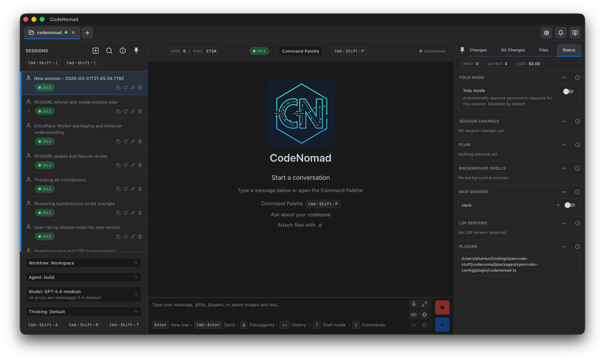

# CodeNomad

> A fast, multi-instance desktop client for running OpenCode sessions the way long-haul builders actually work.

## What is CodeNomad?

CodeNomad is built for people who live inside OpenCode for hours on end and need a cockpit, not a kiosk. When terminals get unwieldy and web clients feel laggy, CodeNomad delivers a desktop-native workspace that favors speed, clarity, and direct control. It runs on macOS, Windows, and Linux using Electron + SolidJS, with prebuilt binaries so you can get started immediately.

## Highlights

- **Long-session native** – scroll through massive transcripts without hitches and keep full context visible.
- **Multiple instances, one window** – juggle several OpenCode instances side-by-side with per-instance tabs.
- **Deep task awareness** – jump into sub/child sessions (Tasks tool) instantly, monitor their status, and answer directly.
- **Keyboard first** – the full UI is optimized for shortcuts so you can stay mouse-free when you want to.
- **Command palette superpowers** – summon a single, global palette to jump tabs, launch tools, tweak preferences, or fire shortcuts faster than the UI can animate.
- **Direct model messaging** – keep an eye on child sessions and send targeted replies without losing your flow.
- **Developer-friendly rendering** – syntax highlighting, inline diffs, and thoughtful presentation keep the signal high.

## Command Palette

The palette is the nerve center of CodeNomad: hit the shortcut once and you can search commands, switch instances, start a new task, open attachments, or tweak settings without taking your hands off the keyboard. Every action is categorized, fuzzy searchable, and previewed so you can chain moves together in seconds. It is the single interface for command execution, which keeps the workflow predictable and fast whether you are juggling one session or ten.

## Requirements

- [OpenCode CLI](https://opencode.ai) installed and available in your `PATH`, or point CodeNomad to a local binary through Advanced Settings.

## Downloads

Grab the latest build for macOS, Windows, and Linux from the [GitHub Releases page](https://github.com/shantur/CodeNomad/releases).

## Quick Start

1. Install the OpenCode CLI and confirm it is reachable via your terminal.
2. Download the CodeNomad build for your platform and launch the app.
3. Connect to one or more OpenCode instances, set keyboard shortcuts in preferences, and start a session.
4. Use tabs to swap between instances, the task sidebar to dive into child sessions, and the prompt input to keep shipping.

