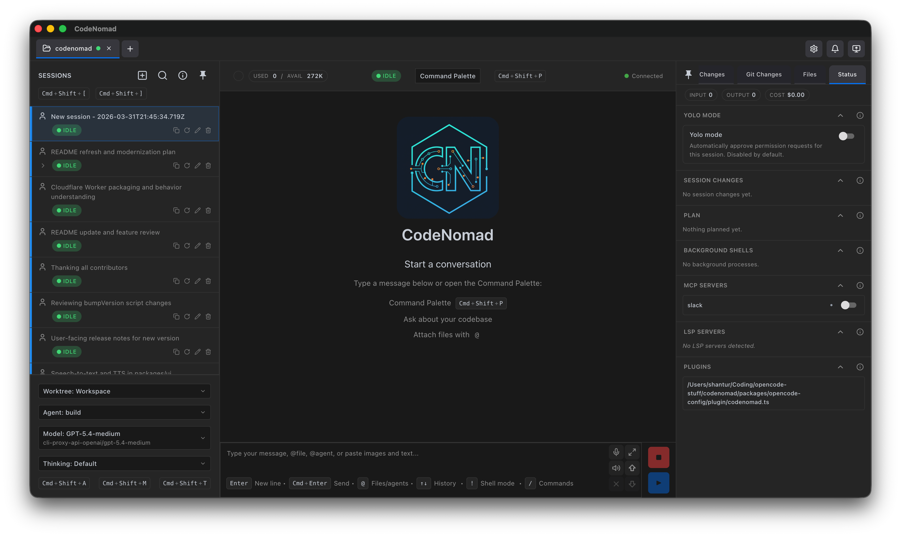

# CodeNomad

## The AI Coding Cockpit for OpenCode

CodeNomad transforms OpenCode from a terminal tool into a **premium desktop workspace** — built for developers who live inside AI coding sessions for hours and need control, speed, and clarity.

> OpenCode gives you the engine. CodeNomad gives you the cockpit.



---

## Features

- **🚀 Multi-Instance Workspace**
- **🌐 Remote Access**
- **🧠 Session Management**
- **🎙️ Voice Input & Speech**
- **🌳 Git Worktrees**
- **💬 Rich Message Experience**
- **⌨️ Command Palette**
- **📁 File System Browser**
- **🔐 Authentication & Security**
- **🔔 Notifications**
- **🎨 Theming**
- **🌍 Internationalization**

---

## Getting Started

### 🖥️ Desktop App

Available as both Electron and Tauri builds — choose based on your preference.

Download the latest installer for your platform from [Releases](https://github.com/shantur/CodeNomad/releases).

| Platform | Formats |
|----------|---------|
| macOS | DMG, ZIP (Universal: Intel + Apple Silicon) |
| Windows | NSIS Installer, ZIP (x64, ARM64) |
| Linux | AppImage, deb, tar.gz (x64, ARM64) |

### 💻 CodeNomad Server

Run as a local server and access via browser. Perfect for remote development.

```bash
npx @neuralnomads/codenomad --launch
```

See [Server Documentation](packages/server/README.md) for flags, TLS, auth, and remote access.

### 🧪 Dev Releases

Bleeding-edge builds from the `dev` branch:

```bash
npx @neuralnomads/codenomad-dev --launch
```

---

## Requirements

- **[OpenCode CLI](https://opencode.ai)** — must be installed and in your `PATH`
- **Node.js 18+** — for server mode or building from source

---

## Development

CodeNomad is a monorepo built with:

| Package | Description |
|---------|-------------|
| **[packages/server](packages/server/README.md)** | Core logic & CLI — workspaces, OpenCode proxy, API, auth, speech |
| **[packages/ui](packages/ui/README.md)** | SolidJS frontend — reactive, fast, beautiful |
| **[packages/electron-app](packages/electron-app/README.md)** | Desktop shell — process management, IPC, native dialogs |
| **[packages/tauri-app](packages/tauri-app)** | Tauri desktop shell (experimental) |

### Quick Start

```bash
git clone https://github.com/NeuralNomadsAI/CodeNomad.git
cd CodeNomad
npm install
npm run dev
```

---

## Troubleshooting

<details>
<summary><strong>macOS: "CodeNomad.app is damaged and can't be opened"</strong></summary>

Gatekeeper flag due to missing notarization. Clear the quarantine attribute:

```bash
xattr -dr com.apple.quarantine /Applications/CodeNomad.app
```

On Intel Macs, also check **System Settings → Privacy & Security** on first launch.
</details>

<details>
<summary><strong>Linux (Wayland + NVIDIA): Tauri App closes immediately</strong></summary>

WebKitGTK DMA-BUF/GBM issue. Run with:

```bash
WEBKIT_DISABLE_DMABUF_RENDERER=1 codenomad
```

See full workaround in the original README.
</details>

---

## Community

[](https://star-history.com/#NeuralNomadsAI/CodeNomad&Date)

---

**Built with ♥ by [Neural Nomads](https://github.com/NeuralNomadsAI)** · [MIT License](LICENSE)
