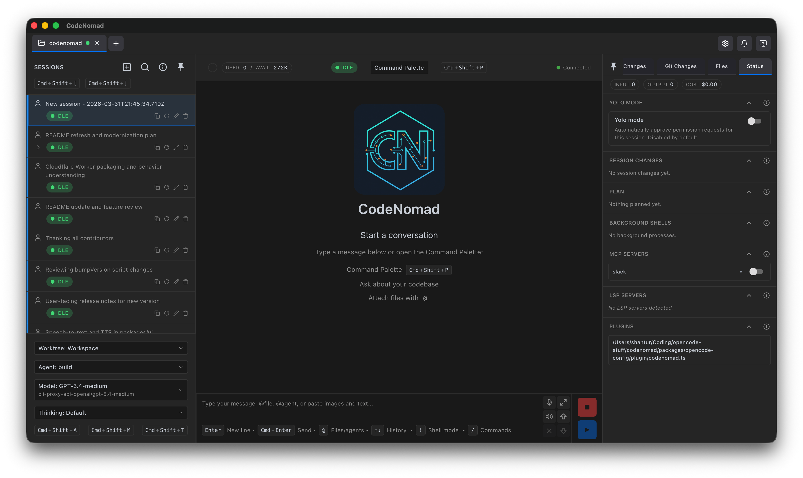

# CodeNomad

## The AI Coding Cockpit for OpenCode

CodeNomad transforms OpenCode from a terminal tool into a **premium desktop workspace** — built for developers who live inside AI coding sessions for hours and need control, speed, and clarity.

> OpenCode gives you the engine. CodeNomad gives you the cockpit.



---

## Features

- **🚀 Multi-Instance Workspace**
- **🌐 Remote Control** through a secure outbound relay, one-time pairing links, and revocable devices
- **🧠 Session Management**
- **🎙️ Voice Input & Speech**
- **🌳 Git Worktrees**
- **💬 Rich Message Experience**
- **🧩 SideCars**
- **⌨️ Command Palette**
- **📁 File System Browser**
- **🔐 Authentication & Security**
- **🔔 Notifications**
- **🎨 Theming**
- **🌍 Internationalization**

---

## Getting Started

### 🖥️ Desktop App

Available as both Electron and Tauri builds — choose based on your preference.

Download the latest installer for your platform from [Releases](https://github.com/shantur/CodeNomad/releases).

| Platform | Formats |
|----------|---------|
| macOS | DMG, ZIP (Universal: Intel + Apple Silicon) |
| Windows | NSIS Installer, ZIP (x64, ARM64) |
| Linux | Tauri deb, Electron portable tar.gz (x64) |

The Tauri deb is currently built and installation-tested on Ubuntu 24.04. Compatibility with older Debian-based distributions is not yet guaranteed.

### 💻 CodeNomad Server

Run as a local server and access via browser. Perfect for remote development.

```bash
npx @neuralnomads/codenomad --password <your-password> --launch
```

> **Authentication required:** The server requires a password on first run. You can pass it via `--password`, the `CODENOMAD_SERVER_PASSWORD` environment variable, or create an `auth.json` file (see [Server Documentation](packages/server/README.md)).

> **Self-signed certificate:** On first launch with HTTPS enabled (the default), your browser will show a "Your connection is not private" warning. This is expected — the server generates a local self-signed certificate automatically. Click **Advanced → Proceed to localhost** to continue. For local-only use without the warning, run with `--https=false --http=true`.

See [Server Documentation](packages/server/README.md) for flags, TLS, authentication, and Remote Control.

### 🧪 Dev Releases

Bleeding-edge builds from the `dev` branch:

```bash
npx @neuralnomads/codenomad-dev --password <your-password> --launch
```

---

## SideCars

SideCars let you open local web tools inside CodeNomad as tabs.

Previews use token-scoped URLs inside opaque-origin sandboxes. Loopback HTTP native previews receive a dedicated `.preview.localhost` origin so root routes, POSTs, and live reload behave normally; HTTPS and web clients use the capability path. Element comments use a source-checked message bridge.

<details>
<summary><strong>Configuration</strong></summary>

- **Name**: Display name used in CodeNomad
- **Port**: Local HTTP or HTTPS service running on `127.0.0.1:<port>`
- **Base path**: Mounted under `/sidecars/:id`
- **Prefix mode**:
  - **Preserve prefix** forwards the full `/sidecars/:id/...` path upstream
  - **Strip prefix** removes `/sidecars/:id` before forwarding the request upstream

</details>

<details>
<summary><strong>VSCode (OpenVSCode Server)</strong></summary>

Run with Docker:

```bash
docker run -it --init -p 8000:3000 -v "${HOME}:${HOME}:cached" -e HOME=${HOME} gitpod/openvscode-server --server-base-path /sidecars/vscode
```

Add SideCar as:

- **Name**: `VSCode`
- **Port**: `http://127.0.0.1:8000`
- **Base path**: `/sidecars/vscode`
- **Prefix mode**: `Preserve prefix`

</details>

<details>
<summary><strong>Terminal (ttyd)</strong></summary>

Run with:

```bash
ttyd --writable zsh
```

Add SideCar as:

- **Name**: `Terminal`
- **Port**: `http://127.0.0.1:7681`
- **Base path**: `/sidecars/terminal`
- **Prefix mode**: `Strip prefix`

</details>

---

## Requirements

- **[OpenCode CLI](https://opencode.ai)** — must be installed and in your `PATH`
- **[Git](https://git-scm.com/downloads)** — a prerequisite for full functionality (repository identity, Git operations and worktrees). Git must be executable in the CodeNomad backend's `PATH`; it is not bundled with the desktop installers.
- **Node.js 18+** — for server mode or building from source

On Windows, install [Git for Windows](https://gitforwindows.org/) with the option to use Git from the command line and third-party software. A per-user installation is sufficient and does not require administrator rights; install into a user-writable directory and make Git available in the user `PATH`. On macOS or Linux, follow the [platform installation instructions](https://git-scm.com/downloads). Fully quit and restart CodeNomad after installation so its backend inherits the updated `PATH`. For a remote server, install Git on the server host for the account running CodeNomad and restart that server process, not just the browser. A Git installation available only inside WSL does not satisfy the Windows backend's requirement.

**Without Git, CodeNomad tolerates a degraded, directory-only mode.** You can open a folder and talk to your agent, including asking it to help install Git. The backend supplies the agent with Git availability and backend platform context before prompts and custom commands; there is no blocking Git installation screen. Git operations and worktree management require Git. Session access is restricted to the explicitly opened physical folder; open another checkout separately to access its conversations. The agent's shell and the CodeNomad backend can run on different hosts, so installation help must target the backend account and environment. Git availability is rechecked on subsequent sends and the agent context is removed once it is available.

---

## Development

CodeNomad is a monorepo built with:

| Package | Description |
|---------|-------------|
| **[packages/server](packages/server/README.md)** | Core logic & CLI — workspaces, OpenCode proxy, API, auth, speech |
| **[packages/ui](packages/ui/README.md)** | SolidJS frontend — reactive, fast, beautiful |
| **[packages/electron-app](packages/electron-app/README.md)** | Desktop shell — process management, IPC, native dialogs |
| **[packages/tauri-app](packages/tauri-app)** | Tauri desktop shell (experimental) |

### Quick Start

```bash
git clone https://github.com/NeuralNomadsAI/CodeNomad.git
cd CodeNomad
npm install
npm run dev
```

---

## Troubleshooting

<details>
<summary><strong>macOS: "CodeNomad.app is damaged and can't be opened"</strong></summary>

Gatekeeper flag due to missing notarization. Clear the quarantine attribute:

```bash
xattr -dr com.apple.quarantine /Applications/CodeNomad.app
```

On Intel Macs, also check **System Settings → Privacy & Security** on first launch.
</details>

<details>
<summary><strong>Linux (Wayland + NVIDIA): Tauri App closes immediately</strong></summary>

WebKitGTK DMA-BUF/GBM issue. Run with:

```bash
WEBKIT_DISABLE_DMABUF_RENDERER=1 codenomad-tauri
```

See full workaround in the original README.
</details>

---

## Community

[](https://github.com/NeuralNomadsAI/CodeNomad/stargazers)

<a href="https://www.star-history.com/?repos=NeuralNomadsAI%2FCodeNomad&amp;type=date">
  <picture>
    <source media="(prefers-color-scheme: dark)" srcset="https://api.star-history.com/chart?repos=NeuralNomadsAI/CodeNomad&amp;type=date&amp;theme=dark" />
    <source media="(prefers-color-scheme: light)" srcset="https://api.star-history.com/chart?repos=NeuralNomadsAI/CodeNomad&amp;type=date" />
    
  </picture>
</a>

---

**Built with ♥ by [Neural Nomads](https://github.com/NeuralNomadsAI)** · [MIT License](LICENSE)
