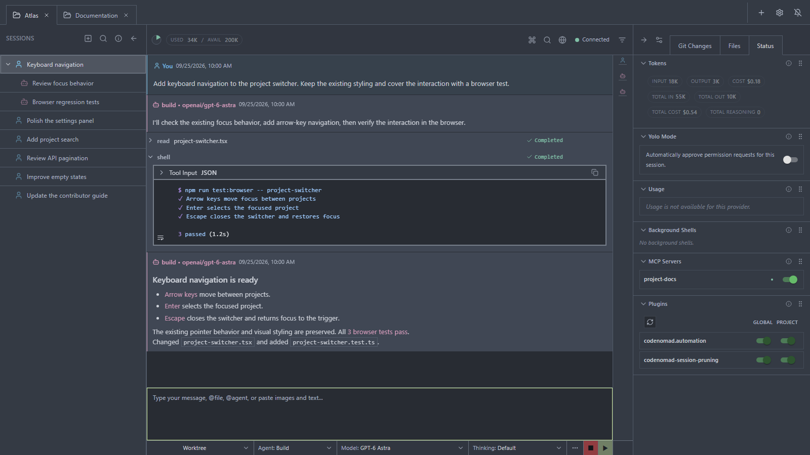

# CodeNomad

## The AI Coding Cockpit for OpenCode

CodeNomad is a **desktop and browser workspace for OpenCode V2** — built for developers who work across projects, long conversations, and Git worktrees. It connects to OpenCode's shared background service, keeping your sessions accessible from CodeNomad and compatible terminal clients.

> OpenCode gives you the engine. CodeNomad gives you the cockpit.



*The 0.20 interface, rendered with demonstration data. [Download the latest stable release](https://github.com/NeuralNomadsAI/CodeNomad/releases/latest).*

---

## Features

- **🚀 Projects and desktop windows** — Keep multiple projects open, with per-window tabs, drafts, attachments, and view restoration.
- **🧠 Sessions and full-history navigation** — Browse nested sessions, fork conversations, search beyond loaded messages, and jump through long histories with a timeline and previews.
- **🌳 Git worktrees** — Create and select worktrees, move a session with its subsessions, and review Git changes without leaving the workspace.
- **💬 Rich conversations** — Markdown, code, diffs, tool-result images, configurable reasoning/tool visibility, and `/btw` for a temporary side question.
- **📎 Files and attachments** — Pick, paste, or drop device files; use `@` references for project files and browse your workspace from the file panel.
- **🌐 Remote access** — Connect to a CodeNomad server from a desktop client or browser, with password authentication and HTTPS support.
- **🧩 Tools and previews** — Monitor native background shells, manage MCP connections and Global/Project plugin activation, and open web tools as SideCars.
- **🔎 Agent-driven browser previews** — Let your agent open and inspect a visible web preview in Electron or Windows Tauri, without a Developer Mode switch.
- **🎙️ Voice input and speech** — Dictate prompts and listen to responses.
- **⌨️ A workspace you can adapt** — Command palette, notifications, customizable panels, independent light/dark palettes, and multiple interface languages.

---

## Getting Started

### 🖥️ Desktop App

Available as both Electron and Tauri builds — choose based on your preference.

Download the archive or package for your platform from [Releases](https://github.com/NeuralNomadsAI/CodeNomad/releases/latest).

| Platform | Electron | Tauri |
|----------|----------|-------|
| macOS | ZIP, separate Intel and Apple Silicon builds | ZIP, separate Intel and Apple Silicon builds |
| Windows | ZIP (x64) | ZIP containing the Windows installer (x64) |
| Linux | Portable tar.gz (x64) | deb (x64) |

The Tauri deb is currently built and installation-tested on Ubuntu 24.04. Compatibility with older Debian-based distributions is not yet guaranteed.

Desktop builds bundle Node.js and npm; **you do not need to install Node.js separately**. On first launch, select an existing compatible OpenCode executable or install OpenCode through the setup screen. You can manage the executable, updates, and service later in **Preferences → OpenCode**.

Open a project folder, connect your model provider, and start a session. Git must be available to the CodeNomad backend for repository and worktree features; see [Requirements](#requirements).

### 💻 CodeNomad Server

Run on your development machine and access it through a browser. Install Node.js/npm and OpenCode V2 on that host first; Node.js 24 LTS is the recommended runtime (see [Requirements](#requirements)).

```bash
npx @neuralnomads/codenomad --password "your-password" --launch
```

The server binds to `127.0.0.1` by default. For remote access, add `--host 0.0.0.0` and connect to the printed HTTPS address; see [Server Documentation](packages/server/README.md#remote-access-binding-rules) for binding and TLS configuration.

> **Authentication:** Supply `--password` or `CODENOMAD_SERVER_PASSWORD` on each start, or use the UI's persistent password setup. `auth.json` is managed by CodeNomad; see [Authentication](packages/server/README.md#authentication).

> **Self-signed certificate:** On first launch with HTTPS enabled (the default), your browser will show a "Your connection is not private" warning. This is expected — the server generates a local self-signed certificate automatically. Click **Advanced → Proceed to localhost** to continue. For local-only use without the warning, run with `--https=false --http=true`.

See [Server Documentation](packages/server/README.md) for flags, TLS, auth, and remote access.

### 🧪 Dev Releases

Bleeding-edge builds from the `dev` branch:

```bash
npx @neuralnomads/codenomad-dev --password "your-password" --launch
```

---

## OpenCode V2 and upgrading from 0.19.x

CodeNomad **0.20.0 requires OpenCode V2**: **2.0.7 minimum**, with **2.0.18 recommended and qualified for this release**. OpenCode V1 and the former V2 beta protocol are not supported. The current requirements are maintained in [`runtime-support.ts`](packages/server/src/opencode/runtime-support.ts).

- **One shared OpenCode service** owns sessions and messages. Closing a CodeNomad tab, window, or backend leaves that service running. Desktop tabs, drafts, and layout are restored separately for each window.
- **Use an existing CLI or install from CodeNomad.** Executables on `PATH` are preferred; the setup screen also supports a selected executable and a shared user npm installation. The former private CodeNomad OpenCode installation is no longer used.
- **Updating the CLI and restarting its service are separate actions.** Use the explicit service controls in Preferences when you want the running daemon to use an updated executable.
- **Remote users should upgrade their CodeNomad server too.** The 0.20 UI requires CodeNomad server 0.20.0 or later.

For a manual CLI installation, follow the [OpenCode V2 installation guide](https://opencode.ai/v2/docs/). The npm package is `@opencode/cli` and the command is `opencode`.

---

## SideCars

SideCars let you open web tools running on the CodeNomad server host inside CodeNomad as tabs. Start the service separately, then add it in **Preferences → SideCars**.

Session web previews are also available from the conversation toolbar. Agent-driven native browser automation is supported in Electron and Windows Tauri; other Tauri platforms use an iframe preview. See [Browser Automation](dev-docs/BROWSER_AUTOMATION.md) for platform details.

<details>
<summary><strong>Configuration</strong></summary>

- **Name**: Display name used in CodeNomad
- **Port**: Numeric port of the service on the server host, at `127.0.0.1:<port>`
- **Protocol**: Select HTTP or HTTPS to match the service
- **Base path**: Derived from the name and displayed as `/sidecars/:id`
- **Prefix mode**:
  - **Preserve prefix** forwards the full `/sidecars/:id/...` path upstream
  - **Strip prefix** removes `/sidecars/:id` before forwarding the request upstream

</details>

<details>
<summary><strong>VSCode (OpenVSCode Server)</strong></summary>

Run with Docker:

```bash
docker run -it --init -p 127.0.0.1:8000:3000 -v "${HOME}:${HOME}:cached" -e HOME=${HOME} gitpod/openvscode-server --server-base-path /sidecars/vscode
```

Add SideCar as:

- **Name**: `VSCode`
- **Port**: `8000`
- **Protocol**: `HTTP`
- **Base path**: `/sidecars/vscode`
- **Prefix mode**: `Preserve prefix`

</details>

<details>
<summary><strong>Terminal (ttyd)</strong></summary>

Run with:

```bash
ttyd --writable zsh
```

Add SideCar as:

- **Name**: `Terminal`
- **Port**: `7681`
- **Protocol**: `HTTP`
- **Base path**: `/sidecars/terminal`
- **Prefix mode**: `Strip prefix`

</details>

---

## Requirements

- **[OpenCode V2](https://opencode.ai/v2/docs/)** — 2.0.7 minimum; 2.0.18 recommended for CodeNomad 0.20.0. Install/select it through desktop setup or provide a compatible CLI on the server host.
- **[Git](https://git-scm.com/downloads)** — a prerequisite for full functionality (repository identity, Git operations and worktrees). Git must be executable in the CodeNomad backend's `PATH`; it is not bundled with the desktop installers.
- **Node.js and npm** — required for the standalone npm server and source builds, bundled with desktop releases. Use **Node.js 24 LTS**; development and release builds use the version in [`.node-version`](.node-version) (currently 24.20.0).

On Windows, install [Git for Windows](https://gitforwindows.org/) with the option to use Git from the command line and third-party software. A per-user installation is sufficient and does not require administrator rights; install into a user-writable directory and make Git available in the user `PATH`. On macOS or Linux, follow the [platform installation instructions](https://git-scm.com/downloads). Fully quit and restart CodeNomad after installation so its backend inherits the updated `PATH`. For a remote server, install Git on the server host for the account running CodeNomad and restart that server process, not just the browser. A Git installation available only inside WSL does not satisfy the Windows backend's requirement.

**Without Git, CodeNomad tolerates a degraded, directory-only mode.** You can open a folder and talk to your agent, including asking it to help install Git. The backend supplies the agent with Git availability and backend platform context before prompts and custom commands; there is no blocking Git installation screen. Git operations and worktree management require Git. Session access is restricted to the explicitly opened physical folder; open another checkout separately to access its conversations. The agent's shell and the CodeNomad backend can run on different hosts, so installation help must target the backend account and environment. Git availability is rechecked on subsequent sends and the agent context is removed once it is available.

---

## Development

CodeNomad is a monorepo built with:

| Package | Description |
|---------|-------------|
| **[packages/server](packages/server/README.md)** | Core logic & CLI — workspaces, OpenCode proxy, API, auth, speech |
| **[packages/ui](packages/ui/README.md)** | SolidJS frontend — reactive, fast, beautiful |
| **[packages/electron-app](packages/electron-app/README.md)** | Desktop shell — process management, IPC, native dialogs |
| **[packages/tauri-app](packages/tauri-app)** | Tauri desktop shell — native windows, integration, and packaging |

### Quick Start

```bash
git clone --branch dev https://github.com/NeuralNomadsAI/CodeNomad.git
cd CodeNomad
npm ci --workspaces --include=optional
npm run dev
```

`npm run dev` starts the Electron development host. Use Node.js from [`.node-version`](.node-version), Git, and a compatible OpenCode V2 CLI. For Tauri, install the [platform build prerequisites](https://v2.tauri.app/start/prerequisites/) and run `npm run dev:tauri`. See [CONTRIBUTING.md](CONTRIBUTING.md) for the development and PR workflow.

---

## Troubleshooting

<details>
<summary><strong>macOS: "CodeNomad.app is damaged and can't be opened"</strong></summary>

Gatekeeper flag due to missing notarization. Clear the quarantine attribute:

```bash
xattr -dr com.apple.quarantine /Applications/CodeNomad.app
```

On Intel Macs, also check **System Settings → Privacy & Security** on first launch.
</details>

<details>
<summary><strong>Linux (Wayland + NVIDIA): Tauri App closes immediately</strong></summary>

WebKitGTK DMA-BUF/GBM issue. Run with:

```bash
WEBKIT_DISABLE_DMABUF_RENDERER=1 codenomad-tauri
```

This applies to the Tauri WebKitGTK build. Electron uses Chromium and can be used as an alternative on the same machine.
</details>

---

## Community

[](https://github.com/NeuralNomadsAI/CodeNomad/stargazers)

<a href="https://www.star-history.com/?repos=NeuralNomadsAI%2FCodeNomad&amp;type=date">
  <picture>
    <source media="(prefers-color-scheme: dark)" srcset="https://api.star-history.com/chart?repos=NeuralNomadsAI/CodeNomad&amp;type=date&amp;theme=dark" />
    <source media="(prefers-color-scheme: light)" srcset="https://api.star-history.com/chart?repos=NeuralNomadsAI/CodeNomad&amp;type=date" />
    
  </picture>
</a>

---

**Built with ♥ by [Neural Nomads](https://github.com/NeuralNomadsAI)** · [MIT License](LICENSE)
