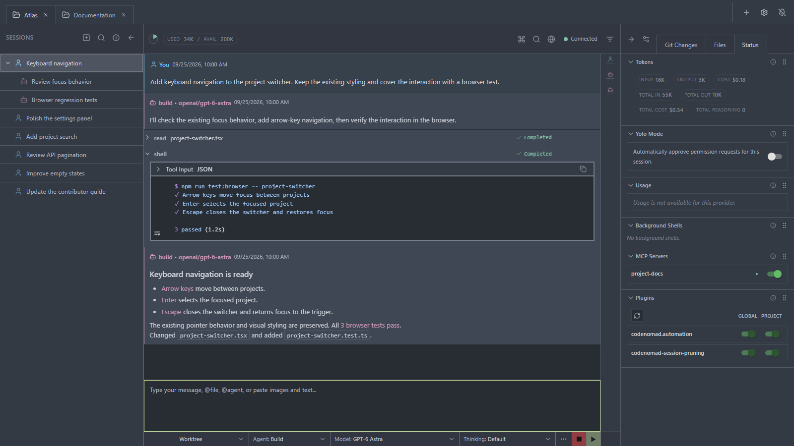

# CodeNomad help

An OpenCode workspace, across projects, sessions, and worktrees.

This guide assumes you already use **OpenCode V2**. It covers CodeNomad's interface and workflow, not the basics of agents or OpenCode configuration.

## Find the control you need

| I want to… | Read |
|---|---|
| Connect CodeNomad to my OpenCode setup | [Connect OpenCode](getting-started.md) |
| Navigate history, attach context, handle requests across sessions | [Conversations](conversations.md) |
| Move a session family between checkouts | [Projects and worktrees](projects.md) |
| Use the file reader, Git views, browser preview, and SideCars | [Files and tools](files-and-tools.md) |
| Control model visibility, accounts, and Global/Project settings | [Settings](settings.md) |
| Diagnose a CodeNomad-specific problem | [Troubleshooting](troubleshooting.md) |

## What stays shared

CodeNomad uses the shared OpenCode service. Sessions and history remain available to compatible OpenCode clients; tabs, drafts, and layout are restored separately per CodeNomad window. Closing a tab or window does **not** stop the service.

## Reference

For native configuration, use the [OpenCode V2 documentation](https://opencode.ai/v2/docs/). For hosting options, use the [CodeNomad server guide](https://github.com/NeuralNomadsAI/CodeNomad/blob/dev/packages/server/README.md).
